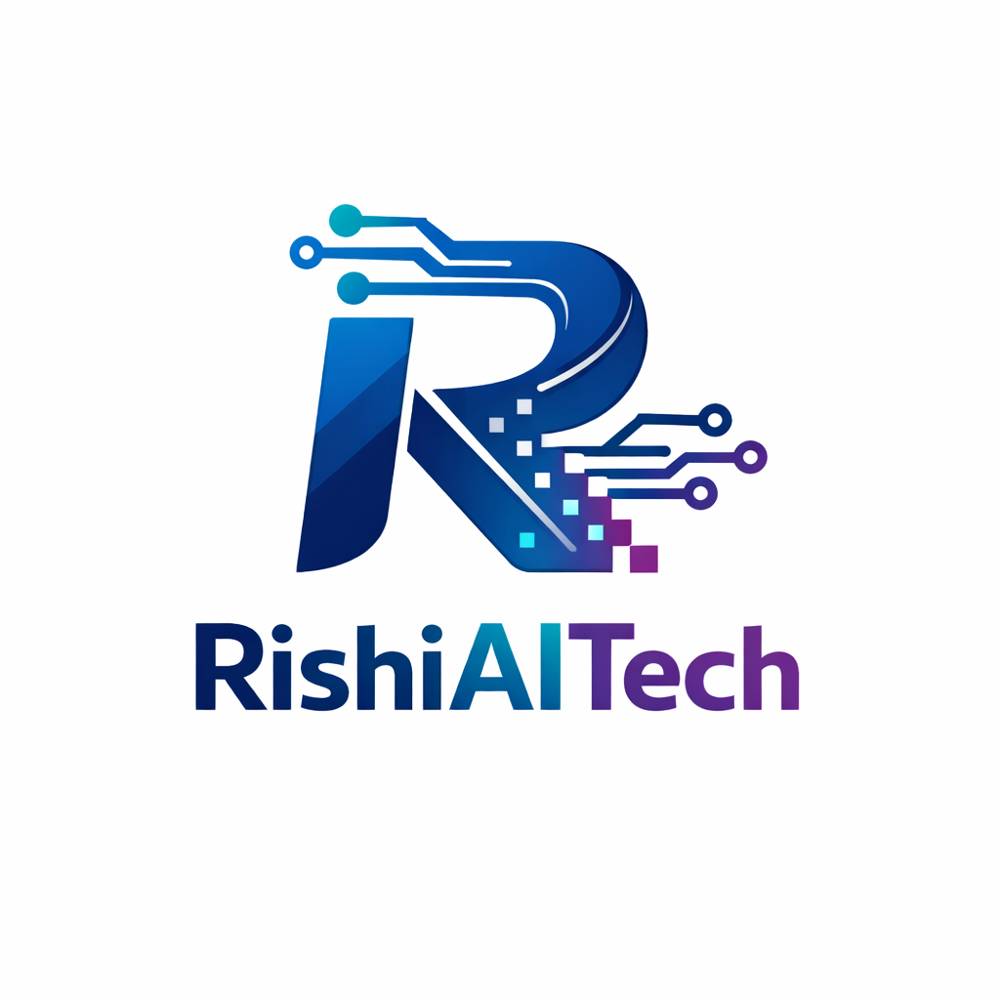

<table>
  <tr>
    <td width="25%" align="center">
      
    </td>
    <td width="75%" align="left">
      <h1>Rishi Ai Tech</h1>
      <h3>Building Intelligent, Scalable & Future-Ready Software Solutions</h3>
      

        🚀 Software Development &nbsp;•&nbsp; 🤖 AI Solutions &nbsp;•&nbsp; 🌐 Web & Mobile Platforms
      

    </td>
  </tr>
</table>

---

## 🏢 About Us

**Rishi Ai Tech** is a technology-focused software company delivering high-quality, scalable, and secure digital products.

We collaborate with startups, enterprises, and growing businesses to convert ideas into powerful software solutions using modern engineering practices, clean architecture, and emerging technologies.

> 💡 *Our vision is to build software that is simple to use, powerful in performance, and scalable for the future.*

---

## 💼 Our Expertise

### 🧠 Intelligent & AI Solutions
- AI-powered applications  
- Automation & smart workflows  
- Data-driven systems  

### 💻 Software Development
- Custom enterprise software  
- Backend & API development  
- High-performance system design  

### 🌐 Web & Mobile Solutions
- Modern web applications  
- Mobile apps (Android & iOS)  
- Admin panels & dashboards  

### ☁️ Cloud & Scalability
- Cloud-ready architectures  
- Secure & scalable deployments  
- DevOps & CI/CD pipelines  

---

## 🛠 Technology Stack

### 🎨 Frontend

  

### ⚙️ Backend

  

### 🗄 Databases

  

### ☁️ Cloud & DevOps

  

### 🧪 Tools & Design

  

---

## 📂 Our Repositories

Our GitHub repositories include:
- Production-grade applications  
- Internal frameworks & utilities  
- Scalable backend services  
- Proof-of-concept & innovation projects  

🔒 Most repositories are private and maintained for client or internal use.

---

## 🔐 Engineering Standards

- Clean, readable & maintainable code  
- Secure development practices  
- Branch-based workflow  
- Mandatory Pull Requests & Code Reviews  
- Industry-standard architecture  

---

## 🌍 Location & Reach

🇮🇳 India  
🌐 Serving clients globally

---

## 📫 Get in Touch

For business inquiries, partnerships, or collaboration:

📧 **contact@rishiaitech.com**  
*(Replace with your official company email)*

---

## 🤝 Maintained By

**Rishi Ai Tech**  
Delivering reliable software.  
Empowering businesses through technology.
